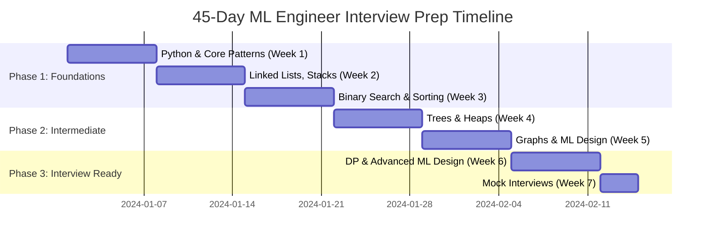

# ML Engineer Interview Accelerator: 45-Day DSA & System Design Mastery

> **Your complete roadmap to crack FAANG AI/ML Engineer interviews**

---

## 🎯 Overview

**Target Role:** AI/ML Engineer at FAANG (Meta, Google, Amazon, LinkedIn, Netflix)

**Focus Areas:** Data Structures & Algorithms (DSA) + ML System Design

**Timeline:** 45 days of intensive preparation

**Daily Commitment:** 4-6 hours/day (135-180 total hours)

**Expected Outcomes:**
- ✅ Master 150-200 curated DSA problems
- ✅ Complete 10-15 ML system design cases  
- ✅ 75-85% success rate reaching final interview rounds

---

## 📊 Three-Phase Structure

### **Phase 1: Foundations (Days 1-15)**
Build strong fundamentals in core DSA patterns and basic problem-solving

### **Phase 2: Intermediate Mastery (Days 16-30)**  
Advanced topics, graph algorithms, and ML system design introduction

### **Phase 3: Interview Ready (Days 31-45)**
Company-specific prep, mock interviews, and ML system design mastery

---

## 🗓️ Detailed 45-Day Breakdown

---

## **PHASE 1: FOUNDATIONS (Days 1-21)**

<b>Week 1: Python & Core Patterns (Days 1-7)</b>

### **Day 1: Python Fundamentals & Setup**
**Goal:** Establish coding environment and Python fluency

**Topics:**
- Python syntax review (lists, dicts, sets, tuples)
- List comprehensions and generators
- Common built-in functions (enumerate, zip, map, filter)
- Collections module (Counter, defaultdict, deque)

**Practice (3-4 problems):**
- [ ] [Two Sum](https://leetcode.com/problems/two-sum/) (Easy)
- [ ] [Contains Duplicate](https://leetcode.com/problems/contains-duplicate/) (Easy)
- [ ] [Valid Anagram](https://leetcode.com/problems/valid-anagram/) (Easy)

**Time:** 4 hours | **Total Problems:** 3

---

### **Day 2: Arrays - Two Pointers Pattern**
**Goal:** Master the two-pointers technique

**Topics:**
- Two pointers from both ends
- Two pointers same direction  
- Fast and slow pointers

**Practice (5-6 problems):**
- [ ] [Remove Duplicates from Sorted Array](https://leetcode.com/problems/remove-duplicates-from-sorted-array/) (Easy)
- [ ] [Move Zeroes](https://leetcode.com/problems/move-zeroes/) (Easy)
- [ ] [Container With Most Water](https://leetcode.com/problems/container-with-most-water/) (Medium)
- [ ] [3Sum](https://leetcode.com/problems/3sum/) (Medium)
- [ ] [Trapping Rain Water](https://leetcode.com/problems/trapping-rain-water/) (Hard - optional)

**Time:** 5 hours | **Total Problems:** 5-6

---

### **Day 3: Arrays - Sliding Window Pattern**  
**Goal:** Master sliding window for substring/subarray problems

**Topics:**
- Fixed-size sliding window
- Variable-size sliding window
- Window expansion and contraction

**Practice (5-6 problems):**
- [ ] [Maximum Average Subarray](https://leetcode.com/problems/maximum-average-subarray-i/) (Easy)
- [ ] [Longest Substring Without Repeating Characters](https://leetcode.com/problems/longest-substring-without-repeating-characters/) (Medium)
- [ ] [Minimum Window Substring](https://leetcode.com/problems/minimum-window-substring/) (Hard)
- [ ] [Permutation in String](https://leetcode.com/problems/permutation-in-string/) (Medium)
- [ ] [Fruit Into Baskets](https://leetcode.com/problems/fruit-into-baskets/) (Medium)

**Time:** 5 hours | **Total Problems:** 5-6

---

### **Day 4: Strings & Character Manipulation**
**Goal:** String processing and pattern matching

**Topics:**
- String manipulation techniques
- Character frequency counting
- Palindrome patterns
- Anagram detection

**Practice (5-6 problems):**
- [ ] [Valid Palindrome](https://leetcode.com/problems/valid-palindrome/) (Easy)
- [ ] [Longest Palindromic Substring](https://leetcode.com/problems/longest-palindromic-substring/) (Medium)
- [ ] [Group Anagrams](https://leetcode.com/problems/group-anagrams/) (Medium)
- [ ] [Longest Repeating Character Replacement](https://leetcode.com/problems/longest-repeating-character-replacement/) (Medium)
- [ ] [Palindromic Substrings](https://leetcode.com/problems/palindromic-substrings/) (Medium)

**Time:** 5 hours | **Total Problems:** 5-6

---

### **Day 5: Hash Maps & Sets**
**Goal:** Leverage hash maps for O(1) lookups

**Topics:**
- Hash map patterns
- Frequency counting
- Set operations
- Two-sum variations

**Practice (5-6 problems):**
- [ ] [Two Sum](https://leetcode.com/problems/two-sum/) (Easy - review)
- [ ] [4Sum II](https://leetcode.com/problems/4sum-ii/) (Medium)
- [ ] [Subarray Sum Equals K](https://leetcode.com/problems/subarray-sum-equals-k/) (Medium)
- [ ] [Longest Consecutive Sequence](https://leetcode.com/problems/longest-consecutive-sequence/) (Medium)
- [ ] [First Missing Positive](https://leetcode.com/problems/first-missing-positive/) (Hard)

**Time:** 5 hours | **Total Problems:** 5-6

---

### **Day 6: Prefix Sum & Array Math**
**Goal:** Optimize range queries with prefix sums

**Topics:**
- Prefix sum arrays
- Running sums
- Range sum queries
- Product arrays

**Practice (5-6 problems):**
- [ ] [Running Sum of 1D Array](https://leetcode.com/problems/running-sum-of-1d-array/) (Easy)
- [ ] [Find Pivot Index](https://leetcode.com/problems/find-pivot-index/) (Easy)
- [ ] [Product of Array Except Self](https://leetcode.com/problems/product-of-array-except-self/) (Medium)
- [ ] [Subarray Sums Divisible by K](https://leetcode.com/problems/subarray-sums-divisible-by-k/) (Medium)
- [ ] [Maximum Sum Circular Subarray](https://leetcode.com/problems/maximum-sum-circular-subarray/) (Medium)

**Time:** 5 hours | **Total Problems:** 5-6

---

### **Day 7: Week 1 Review & Mock Interview**
**Goal:** Consolidate Week 1 learnings

**Activities:**
- [ ] Review all patterns from Week 1
- [ ] Solve 3-4 mixed problems without hints  
- [ ] First mock interview (arrays/strings focus)
- [ ] Identify weak areas

**Practice (3-4 problems):**
- Random selection from Week 1 topics
- Timed practice (45 min per problem)

**Time:** 5 hours

**📊 Week 1 Checkpoint:** ~34 hours | ~35-40 problems solved

---

<b>Week 2: Linked Lists, Stacks, Queues (Days 8-14)</b>

### **Day 8: Linked Lists - Fundamentals**
**Goal:** Master linked list manipulation

**Topics:**
- Linked list traversal
- Reversal techniques
- Two-pointer approach in lists
- Dummy node pattern

**Practice (5-6 problems):**
- [ ] [Reverse Linked List](https://leetcode.com/problems/reverse-linked-list/) (Easy)
- [ ] [Merge Two Sorted Lists](https://leetcode.com/problems/merge-two-sorted-lists/) (Easy)
- [ ] [Remove Nth Node From End](https://leetcode.com/problems/remove-nth-node-from-end-of-list/) (Medium)
- [ ] [Reorder List](https://leetcode.com/problems/reorder-list/) (Medium)
- [ ] [Reverse Nodes in k-Group](https://leetcode.com/problems/reverse-nodes-in-k-group/) (Hard - optional)

**Time:** 5 hours | **Total Problems:** 5-6

---

### **Day 9: Linked Lists - Cycle Detection**
**Goal:** Fast and slow pointer technique

**Topics:**
- Floyd's cycle detection
- Finding cycle start
- Intersection of linked lists

**Practice (4-5 problems):**
- [ ] [Linked List Cycle](https://leetcode.com/problems/linked-list-cycle/) (Easy)
- [ ] [Linked List Cycle II](https://leetcode.com/problems/linked-list-cycle-ii/) (Medium)
- [ ] [Intersection of Two Linked Lists](https://leetcode.com/problems/intersection-of-two-linked-lists/) (Easy)
- [ ] [Happy Number](https://leetcode.com/problems/happy-number/) (Easy)
- [ ] [Find the Duplicate Number](https://leetcode.com/problems/find-the-duplicate-number/) (Medium)

**Time:** 5 hours | **Total Problems:** 4-5

---

### **Day 10: Stacks - Monotonic Stack Pattern**
**Goal:** Use stacks for next greater/smaller element

**Topics:**
- Monotonic increasing stack
- Monotonic decreasing stack
- Next greater element pattern
- Histogram problems

**Practice (5-6 problems):**
- [ ] [Valid Parentheses](https://leetcode.com/problems/valid-parentheses/) (Easy)
- [ ] [Next Greater Element I](https://leetcode.com/problems/next-greater-element-i/) (Easy)
- [ ] [Daily Temperatures](https://leetcode.com/problems/daily-temperatures/) (Medium)
- [ ] [Largest Rectangle in Histogram](https://leetcode.com/problems/largest-rectangle-in-histogram/) (Hard)
- [ ] [Trapping Rain Water](https://leetcode.com/problems/trapping-rain-water/) (Hard - using stack)

**Time:** 5 hours | **Total Problems:** 5-6

---

### **Day 11: Queues & Deques**
**Goal:** Queue-based problem solving

**Topics:**
- Queue operations
- Circular queue
- Deque for sliding window max
- Priority queue introduction

**Practice (4-5 problems):**
- [ ] [Implement Queue using Stacks](https://leetcode.com/problems/implement-queue-using-stacks/) (Easy)
- [ ] [Sliding Window Maximum](https://leetcode.com/problems/sliding-window-maximum/) (Hard - using deque)
- [ ] [Design Circular Queue](https://leetcode.com/problems/design-circular-queue/) (Medium)
- [ ] [Number of Recent Calls](https://leetcode.com/problems/number-of-recent-calls/) (Easy)

**Time:** 4 hours | **Total Problems:** 4-5

---

### **Day 12: Recursion Fundamentals**
**Goal:** Build recursive thinking

**Topics:**
- Recursion basics
- Base cases and recursive cases
- Recursion tree visualization
- Tail recursion

**Practice (5-6 problems):**
- [ ] [Fibonacci Number](https://leetcode.com/problems/fibonacci-number/) (Easy)
- [ ] [Power(x, n)](https://leetcode.com/problems/powx-n/) (Medium)
- [ ] [Reverse String](https://leetcode.com/problems/reverse-string/) (Easy - recursive)
- [ ] [Merge Sort Implementation](https://www.geeksforgeeks.org/merge-sort/) (Medium)
- [ ] [Generate Parentheses](https://leetcode.com/problems/generate-parentheses/) (Medium)

**Time:** 5 hours | **Total Problems:** 5-6

---

### **Day 13: Backtracking - Subsets & Combinations**
**Goal:** Master backtracking for combination generation

**Topics:**
- Backtracking template
- Subsets pattern
- Combinations pattern
- Pruning strategies

**Practice (5-6 problems):**
- [ ] [Subsets](https://leetcode.com/problems/subsets/) (Medium)
- [ ] [Subsets II](https://leetcode.com/problems/subsets-ii/) (Medium)
- [ ] [Combinations](https://leetcode.com/problems/combinations/) (Medium)
- [ ] [Combination Sum](https://leetcode.com/problems/combination-sum/) (Medium)
- [ ] [Combination Sum II](https://leetcode.com/problems/combination-sum-ii/) (Medium)

**Time:** 5 hours | **Total Problems:** 5-6

---

### **Day 14: Week 2 Review & Mock**
**Goal:** Consolidate linked lists, stacks, recursion

**Activities:**
- [ ] Pattern review
- [ ] Mixed problem set
- [ ] Second mock interview
- [ ] Week 2 retrospective

**Time:** 5 hours

**📊 Week 2 Checkpoint:** ~34 hours | ~33-38 problems solved

---

<b>Week 3: Binary Search & Buffer (Days 15-21)</b>

### **Day 15: Binary Search - Fundamentals**
**Goal:** Master binary search template

**Topics:**
- Classic binary search
- Left and right boundary search
- Binary search on answer space
- Rotated array search

**Practice (5-6 problems):**
- [ ] [Binary Search](https://leetcode.com/problems/binary-search/) (Easy)
- [ ] [Search Insert Position](https://leetcode.com/problems/search-insert-position/) (Easy)
- [ ] [Find First and Last Position](https://leetcode.com/problems/find-first-and-last-position-of-element-in-sorted-array/) (Medium)
- [ ] [Search in Rotated Sorted Array](https://leetcode.com/problems/search-in-rotated-sorted-array/) (Medium)
- [ ] [Find Minimum in Rotated Sorted Array](https://leetcode.com/problems/find-minimum-in-rotated-sorted-array/) (Medium)

**Time:** 5 hours | **Total Problems:** 5-6

---

### **Day 16: Binary Search - Advanced**
**Goal:** Binary search on answer space

**Topics:**
- Minimizing/maximizing objective function
- Capacity/speed optimization
- Peak finding

**Practice (5-6 problems):**
- [ ] [Koko Eating Bananas](https://leetcode.com/problems/koko-eating-bananas/) (Medium)
- [ ] [Capacity To Ship Packages](https://leetcode.com/problems/capacity-to-ship-packages-within-d-days/) (Medium)
- [ ] [Split Array Largest Sum](https://leetcode.com/problems/split-array-largest-sum/) (Hard)
- [ ] [Find Peak Element](https://leetcode.com/problems/find-peak-element/) (Medium)
- [ ] [Search a 2D Matrix](https://leetcode.com/problems/search-a-2d-matrix/) (Medium)

**Time:** 5 hours | **Total Problems:** 5-6

---

### **Day 17: Sorting Algorithms**
**Goal:** Understand sorting fundamentals

**Topics:**
- Merge Sort implementation
- Quick Sort implementation
- Counting Sort
- Custom comparators

**Practice (4-5 problems):**
- [ ] [Sort Colors](https://leetcode.com/problems/sort-colors/) (Medium)
- [ ] [Merge Intervals](https://leetcode.com/problems/merge-intervals/) (Medium)
- [ ] [Insert Interval](https://leetcode.com/problems/insert-interval/) (Medium)
- [ ] [Non-overlapping Intervals](https://leetcode.com/problems/non-overlapping-intervals/) (Medium)

**Time:** 4 hours | **Total Problems:** 4-5

---

### **Days 18-21: PHASE 1 BUFFER & CONSOLIDATION**
**Goal:** Catch up, review, and solidify

**Activities:**
- [ ] Revisit weak topics from Weeks 1-3
- [ ] Solve additional problems in struggling areas
- [ ] Third mock interview (all Phase 1 topics)
- [ ] Create pattern cheat sheet
- [ ] Rest day (Day 21 recommended)

**Time:** 16 hours over 4 days

**📊 Phase 1 Complete:** ~93 hours | ~100-120 problems solved

---

## **PHASE 2: INTERMEDIATE MASTERY (Days 22-35)**

<b>Week 4: Trees & Heaps (Days 22-28)</b>

### **Day 22: Binary Trees - Traversals**
**Goal:** Master tree traversal techniques

**Topics:**
- Inorder, Preorder, Postorder
- Iterative traversals using stack
- Level-order traversal (BFS)
- Morris traversal (optional)

**Practice (5-6 problems):**
- [ ] [Binary Tree Inorder Traversal](https://leetcode.com/problems/binary-tree-inorder-traversal/) (Easy)
- [ ] [Binary Tree Level Order Traversal](https://leetcode.com/problems/binary-tree-level-order-traversal/) (Medium)
- [ ] [Binary Tree Zigzag Level Order](https://leetcode.com/problems/binary-tree-zigzag-level-order-traversal/) (Medium)
- [ ] [Binary Tree Right Side View](https://leetcode.com/problems/binary-tree-right-side-view/) (Medium)
- [ ] [Flatten Binary Tree to Linked List](https://leetcode.com/problems/flatten-binary-tree-to-linked-list/) (Medium)

**Time:** 5 hours | **Total Problems:** 5-6

---

### **Day 23: Binary Search Trees**
**Goal:** Leverage BST properties

**Topics:**
- BST validation
- BST insertion and deletion
- Lowest common ancestor
- Kth smallest element

**Practice (5-6 problems):**
- [ ] [Validate BST](https://leetcode.com/problems/validate-binary-search-tree/) (Medium)
- [ ] [Lowest Common Ancestor of BST](https://leetcode.com/problems/lowest-common-ancestor-of-a-binary-search-tree/) (Easy)
- [ ] [Kth Smallest Element in BST](https://leetcode.com/problems/kth-smallest-element-in-a-bst/) (Medium)
- [ ] [Delete Node in BST](https://leetcode.com/problems/delete-node-in-a-bst/) (Medium)
- [ ] [Convert Sorted Array to BST](https://leetcode.com/problems/convert-sorted-array-to-binary-search-tree/) (Easy)

**Time:** 5 hours | **Total Problems:** 5-6

---

### **Day 24: Tree Construction & Properties**
**Goal:** Build and analyze trees

**Topics:**
- Tree construction from traversals
- Tree diameter and height
- Path sum problems
- Tree serialization

**Practice (5-6 problems):**
- [ ] [Construct Binary Tree from Preorder and Inorder](https://leetcode.com/problems/construct-binary-tree-from-preorder-and-inorder-traversal/) (Medium)
- [ ] [Maximum Depth of Binary Tree](https://leetcode.com/problems/maximum-depth-of-binary-tree/) (Easy)
- [ ] [Diameter of Binary Tree](https://leetcode.com/problems/diameter-of-binary-tree/) (Easy)
- [ ] [Binary Tree Maximum Path Sum](https://leetcode.com/problems/binary-tree-maximum-path-sum/) (Hard)
- [ ] [Serialize and Deserialize Binary Tree](https://leetcode.com/problems/serialize-and-deserialize-binary-tree/) (Hard)

**Time:** 5 hours | **Total Problems:** 5-6

---

### **Day 25: Heaps & Priority Queues - Fundamentals**
**Goal:** Master heap operations

**Topics:**
- Min heap and max heap
- Heapify operations
- Python heapq module
- Top-K pattern

**Practice (5-6 problems):**
- [ ] [Kth Largest Element in Array](https://leetcode.com/problems/kth-largest-element-in-an-array/) (Medium)
- [ ] [Top K Frequent Elements](https://leetcode.com/problems/top-k-frequent-elements/) (Medium)
- [ ] [Find Median from Data Stream](https://leetcode.com/problems/find-median-from-data-stream/) (Hard)
- [ ] [K Closest Points to Origin](https://leetcode.com/problems/k-closest-points-to-origin/) (Medium)
- [ ] [Last Stone Weight](https://leetcode.com/problems/last-stone-weight/) (Easy)

**Time:** 5 hours | **Total Problems:** 5-6

---

### **Day 26: Heaps - Advanced Applications**
**Goal:** Complex heap problems

**Topics:**
- Merge K sorted lists
- Task scheduling
- Meeting rooms
- Dual heap pattern

**Practice (5-6 problems):**
- [ ] [Merge K Sorted Lists](https://leetcode.com/problems/merge-k-sorted-lists/) (Hard)
- [ ] [Task Scheduler](https://leetcode.com/problems/task-scheduler/) (Medium)
- [ ] [Meeting Rooms II](https://leetcode.com/problems/meeting-rooms-ii/) (Medium)
- [ ] [Reorganize String](https://leetcode.com/problems/reorganize-string/) (Medium)
- [ ] [Sliding Window Median](https://leetcode.com/problems/sliding-window-median/) (Hard)

**Time:** 5 hours | **Total Problems:** 5-6

---

### **Day 27: Tries**
**Goal:** Understand trie data structure

**Topics:**
- Trie implementation
- Prefix searching
- Word search optimization
- Autocomplete pattern

**Practice (4-5 problems):**
- [ ] [Implement Trie](https://leetcode.com/problems/implement-trie-prefix-tree/) (Medium)
- [ ] [Word Search II](https://leetcode.com/problems/word-search-ii/) (Hard)
- [ ] [Design Add and Search Words Data Structure](https://leetcode.com/problems/design-add-and-search-words-data-structure/) (Medium)
- [ ] [Replace Words](https://leetcode.com/problems/replace-words/) (Medium)

**Time:** 4 hours | **Total Problems:** 4-5

---

### **Day 28: Week 4 Review & ML System Design Intro**
**Goal:** Tree/heap consolidation + first ML design

**Activities:**
- [ ] Week 4 pattern review
- [ ] Fourth mock interview (trees/heaps)
- [ ] **First ML System Design:** Introduction to ML system components

**ML System Design Study:**
- Feature store architecture basics
- Read: Meta's News Feed ranking overview

**Time:** 5 hours (3h DSA review + 2h ML system design intro)

**📊 Week 4 Checkpoint:** ~33 hours | ~30-36 problems solved

---

<b>Week 5: Graphs & ML System Design (Days 29-35)</b>

### **Day 29: Graphs - DFS & BFS**
**Goal:** Master graph traversal

**Topics:**
- Graph representations (adjacency list/matrix)
- DFS implementation
- BFS implementation
- Connected components

**Practice (5-6 problems):**
- [ ] [Number of Islands](https://leetcode.com/problems/number-of-islands/) (Medium)
- [ ] [Clone Graph](https://leetcode.com/problems/clone-graph/) (Medium)
- [ ] [Course Schedule](https://leetcode.com/problems/course-schedule/) (Medium)
- [ ] [Course Schedule II](https://leetcode.com/problems/course-schedule-ii/) (Medium)
- [ ] [Pacific Atlantic Water Flow](https://leetcode.com/problems/pacific-atlantic-water-flow/) (Medium)

**Time:** 5 hours | **Total Problems:** 5-6

---

### **Day 30: Graphs - Shortest Path**
**Goal:** Dijkstra and weighted graphs

**Topics:**
- Dijkstra's algorithm
- Bellman-Ford (concept)
- Network delay problems
- Multi-source BFS

**Practice (4-5 problems):**
- [ ] [Network Delay Time](https://leetcode.com/problems/network-delay-time/) (Medium)
- [ ] [Cheapest Flights Within K Stops](https://leetcode.com/problems/cheapest-flights-within-k-stops/) (Medium)
- [ ] [Path With Minimum Effort](https://leetcode.com/problems/path-with-minimum-effort/) (Medium)
- [ ] [Shortest Path in Binary Matrix](https://leetcode.com/problems/shortest-path-in-binary-matrix/) (Medium)

**Time:** 5 hours | **Total Problems:** 4-5

---

### **Day 31: ML System Design Case 1 - Recommendation System** 🎯
**Goal:** Design Instagram Explore / Product Recommendations

**Topics:**
- Candidate generation (retrieval)
- Ranking stage
- Re-ranking and diversity
- Feature engineering for recommendations
- Collaborative filtering vs content-based
- Cold start problem

**Activities:**
- [ ] Study Meta/Amazon recommendation architecture
- [ ] Design end-to-end recommendation pipeline
- [ ] Practice whiteboarding the design
- [ ] Solve 3 graph review problems

**Resources:**
- [ByteByteGo: Recommendation System Design](https://bytebytego.com)
- Meta Engineering Blog on Recommendations

**Time:** 6 hours (4h system design + 2h DSA)

---

### **Day 32: Graphs - Topological Sort & Union Find**
**Goal:** Advanced graph algorithms

**Topics:**
- Topological sort (Kahn's algorithm)
- Cycle detection in directed graphs
- Union find (disjoint set)
- Minimum spanning tree (concept)

**Practice (5-6 problems):**
- [ ] [Course Schedule](https://leetcode.com/problems/course-schedule/) (Medium - revisit)
- [ ] [Alien Dictionary](https://leetcode.com/problems/alien-dictionary/) (Hard)
- [ ] [Number of Provinces](https://leetcode.com/problems/number-of-provinces/) (Medium)
- [ ] [Redundant Connection](https://leetcode.com/problems/redundant-connection/) (Medium)
- [ ] [Accounts Merge](https://leetcode.com/problems/accounts-merge/) (Medium)

**Time:** 5 hours | **Total Problems:** 5-6

---

### **Day 33: ML System Design Case 2 - News Feed Ranking** 🎯
**Goal:** Design Facebook/LinkedIn News Feed

**Topics:**
- Multi-stage ranking architecture
- Feature extraction (user, content, context)
- Personalization signals
- Ranking model training
- A/B testing framework
- Engagement metrics

**Activities:**
- [ ] Study Meta's News Feed engineering blog
- [ ] Design complete feed ranking system
- [ ] Handle scalability (billions of users)
- [ ] Solve 3 DSA problems

**Resources:**
- [Meta Engineering: News Feed Ranking](https://engineering.fb.com/2021/01/26/ml-applications/news-feed-ranking/)

**Time:** 6 hours (4h system design + 2h DSA)

---

### **Day 34: Graph Practice & Feature Store Deep Dive**
**Goal:** Mixed graphs + ML infrastructure

**Practice (4-5 graph problems):**
- [ ] [Word Ladder](https://leetcode.com/problems/word-ladder/) (Hard)
- [ ] [Surrounded Regions](https://leetcode.com/problems/surrounded-regions/) (Medium)
- [ ] [Graph Valid Tree](https://leetcode.com/problems/graph-valid-tree/) (Medium)
- [ ] [Critical Connections in a Network](https://leetcode.com/problems/critical-connections-in-a-network/) (Hard)

**ML System Design Study:**
- [ ] Feature Store deep dive (Feast, Tecton)
- [ ] Offline vs online features
- [ ] Feature freshness and latency

**Time:** 6 hours (3h graphs + 3h system design)

---

### **Day 35: Week 5 Review**
**Goal:** Consolidate graphs and ML design

**Activities:**
- [ ] Graph pattern review
- [ ] Fifth mock interview (graphs)
- [ ] ML system design mock (recommendation or feed)
- [ ] Rest day recommended

**Time:** 5 hours

**📊 Week 5 Checkpoint:** ~32 hours | ~18-23 DSA problems + 2 ML system designs

---

## **PHASE 3: INTERVIEW READY (Days 36-45)**

<b>Week 6: DP (Light) + Advanced ML Design (Days 36-42)</b>

### **Day 36: DP - 1D Problems**
**Goal:** Basic DP patterns

**Topics:**
- Fibonacci-style DP
- House robber pattern
- Climbing stairs variations
- State transition

**Practice (5-6 problems):**
- [ ] [Climbing Stairs](https://leetcode.com/problems/climbing-stairs/) (Easy)
- [ ] [House Robber](https://leetcode.com/problems/house-robber/) (Medium)
- [ ] [House Robber II](https://leetcode.com/problems/house-robber-ii/) (Medium)
- [ ] [Decode Ways](https://leetcode.com/problems/decode-ways/) (Medium)
- [ ] [Coin Change](https://leetcode.com/problems/coin-change/) (Medium)

**Time:** 5 hours | **Total Problems:** 5-6

---

### **Day 37: DP - 2D Grid & LCS**
**Goal:** Grid DP and subsequence problems

**Topics:**
- Unique paths pattern
- Longest common subsequence
- Edit distance

**Practice (4-5 problems):**
- [ ] [Unique Paths](https://leetcode.com/problems/unique-paths/) (Medium)
- [ ] [Minimum Path Sum](https://leetcode.com/problems/minimum-path-sum/) (Medium)
- [ ] [Longest Common Subsequence](https://leetcode.com/problems/longest-common-subsequence/) (Medium)
- [ ] [Edit Distance](https://leetcode.com/problems/edit-distance/) (Hard - optional)

**Time:** 5 hours | **Total Problems:** 4-5

---

### **Day 38: ML System Design Case 3 - Ad Targeting/Ranking** 🎯
**Goal:** Design ad auction and ranking system

**Topics:**
- Ad auction mechanisms
- CTR prediction
- Pacing and budget constraints
- Real-time bidding
- Advertiser vs user optimization

**Activities:**
- [ ] Study Meta/Google Ads architecture
- [ ] Design complete ad system
- [ ] Handle billions of ads and users
- [ ] Light DP review

**Time:** 6 hours (5h system design + 1h DP review)

---

### **Day 39: ML System Design Case 4 - People You May Know** 🎯
**Goal:** Social network recommendation

**Topics:**
- Graph-based recommendations
- Common connections algorithm
- Mutual friends scoring
- Network effects
- Privacy considerations

**Activities:**
- [ ] Study LinkedIn's PYMK system
- [ ] Design friend recommendation pipeline
- [ ] Mixed DSA problems

**Time:** 6 hours (5h system design + 1h DSA)

---

### **Day 40: ML System Design Case 5 - Search Ranking** 🎯
**Goal:** Design search and ranking system

**Topics:**
- Query understanding
- Document retrieval (inverted index)
- Ranking signals
- Learning to rank
- Query expansion

**Activities:**
- [ ] Study Google/Bing search architecture
- [ ] Design end-to-end search system
- [ ] DSA practice

**Time:** 6 hours (5h system design + 1h DSA)

---

### **Day 41: Company-Specific Prep - Meta**
**Goal:** Meta-tagged problems

**Practice (6-8 problems):**
- [ ] Meta top frequency problems from LeetCode
- [ ] Focus on medium difficulty
- [ ] Social network context problems

**Resources:**
- [LeetCode Meta Tagged Problems](https://leetcode.com/company/facebook/)

**Time:** 6 hours | **Total Problems:** 6-8

---

### **Day 42: Company-Specific Prep - Google**
**Goal:** Google-tagged problems

**Practice (6-8 problems):**
- [ ] Google top frequency problems
- [ ] Focus on arrays, strings, graphs
- [ ] System scalability thinking

**Resources:**
- [LeetCode Google Tagged Problems](https://leetcode.com/company/google/)

**Time:** 6 hours | **Total Problems:** 6-8

**📊 Week 6 Checkpoint:** ~40 hours | ~15-20 DSA problems + 3 ML designs

---

<b>Week 7: Mock Interviews & Final Prep (Days 43-45)</b>

### **Day 43: Full Mock Interview Day 1** 🎤
**Goal:** Simulate real interview

**Activities:**
- [ ] 2 x 45-min coding interviews (Medium problems)
- [ ] 1 x 60-min ML system design interview
- [ ] Get feedback and analyze
- [ ] Document learnings

**Mock Interview Platforms:**
- [Pramp](https://www.pramp.com/) (Free)
- [interviewing.io](https://interviewing.io/)
- [LeetCode Mock Assessments](https://leetcode.com/assessment/)

**Time:** 6 hours

---

### **Day 44: Full Mock Interview Day 2** 🎤
**Goal:** Company-specific simulation

**Activities:**
- [ ] 1 x coding interview (Meta/Google style)
- [ ] 1 x ML system design (e.g., News Feed)
- [ ] Behavioral interview prep
- [ ] Review common questions

**Behavioral Prep (STAR Method):**
- [ ] Most challenging project
- [ ] Conflict with teammate
- [ ] Failed project and learnings
- [ ] Leadership example

**Time:** 6 hours

---

### **Day 45: Final Review & Confidence Building** ✅
**Goal:** Consolidate and relax

**Activities:**
- [ ] Review pattern cheat sheet
- [ ] Solve 3-5 favorite problems end-to-end
- [ ] Review all ML system design cases
- [ ] Mental preparation and affirmations
- [ ] Prepare interview logistics (Zoom, whiteboard setup)
- [ ] Get adequate sleep (8 hours minimum)

**Final Checklist:**
- [ ] All 150+ problems reviewed
- [ ] 10 ML system designs mastered
- [ ] Mock interview feedback incorporated
- [ ] Resume polished
- [ ] Behavioral stories prepared
- [ ] Interview outfit ready
- [ ] Positive mindset

**Time:** 4 hours

**📊 Week 7 Complete:** ~16 hours | 5-8 problems + mocks

---

## 📈 Problem Tracking Summary

**Total Problems Solved:** 150-200 problems

### **By Difficulty:**
- 🟢 Easy: 30-40 (20%)
- 🟡 Medium: 100-130 (70%)
- 🔴 Hard: 20-30 (10%)

### **By Topic:**
| Topic | Problem Count |
|-------|---------------|
| Arrays/Strings | 35-40 |
| Hash Maps | 15-20 |
| Linked Lists | 10-15 |
| Stacks/Queues | 10-12 |
| Recursion/Backtracking | 12-15 |
| Binary Search | 12-15 |
| Trees | 20-25 |
| Heaps | 12-15 |
| Graphs | 18-22 |
| DP | 10-15 |
| Company-specific | 15-20 |

**ML System Design Cases:** 10-15 complete designs

---

## 🎯 Success Metrics & Milestones

### **Week-by-Week Checkpoints:**

| Week | Hours | Problems | ML Designs | Status |
|------|-------|----------|------------|--------|
| Week 1 | 34h | 35-40 | 0 | ✅ |
| Week 2 | 34h | 33-38 | 0 | ✅ |
| Week 3 | 25h | 24-28 | 0 | ✅ |
| **Phase 1** | **93h** | **100-120** | **0** | **✅** |
| Week 4 | 33h | 30-36 | 0-1 | ✅ |
| Week 5 | 32h | 18-23 | 2 | ✅ |
| **Phase 2** | **65h** | **48-59** | **2-3** | **✅** |
| Week 6 | 40h | 15-20 | 3 | ✅ |
| Week 7 | 16h | 5-8 | Mocks | ✅ |
| **Phase 3** | **56h** | **20-28** | **3 + Mocks** | **✅** |
| **TOTAL** | **214h** | **168-207** | **5-6 + Mocks** | **🎯** |

---

## 📚 Recommended Resources

### **DSA Practice Platforms:**
- 🔥 [LeetCode](https://leetcode.com/) - Primary platform
- 📺 [NeetCode](https://neetcode.io/) - Pattern-organized with videos
- 🎓 [AlgoExpert](https://www.algoexpert.io/) - Alternative with explanations

### **ML System Design:**
- 📖 [Machine Learning System Design Interview by Ali Aminian & Alex Xu](https://www.amazon.com/Machine-Learning-System-Design-Interview/dp/1736049127)
- 🎓 [Educative.io - Grokking ML System Design](https://www.educative.io/courses/grokking-the-machine-learning-interview)
- 📝 [ByteByteGo ML System Design](https://bytebytego.com/)
- 🔗 [Meta Engineering Blog](https://engineering.fb.com/)

### **Mock Interview Platforms:**
- 🤝 [Pramp](https://www.pramp.com/) - Free peer interviews
- 💼 [interviewing.io](https://interviewing.io/) - Real engineer feedback
- 🎯 [LeetCode Mock Assessments](https://leetcode.com/assessment/) - Timed practice

### **Problem Lists:**
- [Blind 75](https://leetcode.com/discuss/general-discussion/460599/blind-75-leetcode-questions) - Must-solve
- [Grind 169](https://www.techinterviewhandbook.org/grind75) - Extended coverage
- [NeetCode 150](https://neetcode.io/practice) - Pattern-based

---

## 💡 Tips for Success

### **Daily Habits:**
1. ✅ **Start with pattern review** (15 min)
2. ✅ **Solve problems without looking at solutions** (at least 30 min struggle)
3. ✅ **Review solutions and optimize** (learn multiple approaches)
4. ✅ **Write clean, production-quality code** (variable names, edge cases)
5. ✅ **Explain out loud** (practice communication)

### **When Stuck:**
- 🤔 Spend 30-45 minutes trying on your own
- 💡 Look at hints, not full solutions
- 🧠 Understand the pattern, not just the answer
- 🔄 Solve similar problems to reinforce

### **Avoid Burnout:**
- 🛌 Take 1 day off per week (Day 21, Day 35 recommended)
- ⏸️ 10-minute breaks every 90 minutes
- 💪 Exercise and sleep (8 hours minimum)
- 🎉 Celebrate small wins

---

## 🚀 Post-45 Days: Active Interviewing

### **Week 7-8: Interview Phase**
- 📅 Schedule interviews strategically (easier companies first)
- 🔄 Continue daily practice (2-3 problems/day)
- 📝 Review ML system design cases before each interview
- 📊 Track interview feedback and adjust

### **Continuous Learning:**
- 💬 Every failed interview is learning
- 🎯 Keep problem-solving sharp between rounds
- 📄 Update resume with new projects
- 🤝 Network and referrals matter

---

## ✅ Final Checklist

Before declaring yourself "interview ready":

- [ ] Solved 150+ curated problems
- [ ] Can explain 10+ common patterns confidently
- [ ] Completed 10-15 ML system design cases
- [ ] 5+ full mock interviews with feedback
- [ ] Can code fluently in Python without IDE assistance
- [ ] Understand time/space complexity analysis
- [ ] Know Meta/Google/Amazon interview format
- [ ] Behavioral stories prepared (STAR method)
- [ ] Resume updated and reviewed
- [ ] LinkedIn profile optimized
- [ ] Referrals secured (if possible)

---

## 🤝 Contributing

Found this roadmap helpful? Consider:

- ⭐ **Star this repository**
- 🍴 **Fork and customize** for your journey
- 🐛 **Report issues** or suggest improvements
- 💡 **Share your success story** in Discussions
- 🔗 **Contribute problem solutions** to help others

---

## 📞 Connect & Support

**Created by:** [Sai Harsha Kondaveeti](https://github.com/saiharsha-k)

**Portfolio:** [saiharshakondaveeti.com](https://saiharshakondaveeti.com)

**LinkedIn:** [linkedin.com/in/sai-harsha-kondaveeti](https://linkedin.com/in/sai-harsha-kondaveeti)

**AI Trailblazer Blog:** [Substack](https://aitrailblazer.substack.com)

---

## 📄 License

MIT License - Free to use, modify, and share.

---

**Good luck on your ML Engineer interview journey! 🎯**

**Remember:** Consistency > Intensity. Show up every day, trust the process, and you'll be ready for FAANG interviews in 45 days.

---

⭐ **If this roadmap helped you land your dream job, consider starring this repo and sharing your story!**